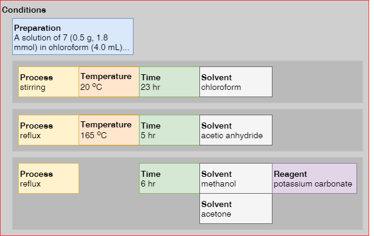

# UDM XML Schema Change Log

## Changes introduced in 4.0.0

## Changes 4.0.0 to 5.0.1

### XML Schema

Note

> XML Schema 1.0 has limited support for unambiguous language constructs and
> e.g. choices of elements cannot be fully restricted.  One example is the
> types that should allow only one of the following subelements: `min`, `max`,
> `min` and `max`, `exact`.  XML Schema allows only encoding one of the
> following two approximate scenarios: (a) one or more of the listed
> sub-elements or (b) zero or one of the listed subelements.  We have assumed
> that it is safer to allow empty elements and incomplete information rather
> than multiple values of the same sub-element. This strategy is applied to
> elements like `PH`, `PRESSURE`, `TEMPERATURE`, `TIME`:

```xml
<!-- Allowed in the selected strategy, not allowed in the alternative one. -->
<TEMPERATURE></TEMPERATURE>
<!-- Allowed in the selected strategy, not allowed in the alternative one. -->
<TEMPERATURE>
  <max>100</max>
  <incr unit="deg_C/hour">5</incr>
</TEMPERATURE>
<!-- Not allowed in the selected strategy, allowed in the alternative one. -->
<TEMPERATURE>
  <max>100</max>
  <min>90</min>
  <max>100</max>
  <incr unit="deg_C/hour">5</incr>
</TEMPERATURE>
```

1. `CATALYSTS` renamed to `CATALYST`; removed hardcoded limits: eight
   `COMMENTS`, 20 `SAMPLE_ID`, 20 `SAMPLE_REF`, 20 `COMPOUND_NAME` per
   catalyst; Added new property: `ENANTIOMERIC_PURITY`.

1. Added new attributes for the `CLP` entity: `method`, `software`, `version`,
   `unit`

1. `COMMENTS` renamed to `COMMENT`.

1. `CONDITIONS`

    The reaction condition model has been significantly refactored to allow
    grouping of related conditions.  In contrast to previous versions only
    single instance of the `CONDITIONS` element per variation is allowed.
    Furthermore, additional condition types have been introduced
    (`BUFFER_TYPE`, `BUFFER_CONCENTRATION`, `STIRRING`, `PROCESS`) as well as
    references to various types of agents (`REACTANT_ID`, `CATALYST_ID`,
    `SOLVENT_ID`, `REAGENT_ID`). Another change is that in this version the
    `PREPARATION` element can be used in two different locations: (1) at the
    very beginning of the `CONDITIONS` block and (2) inside
    `CONDITION_GROUP`. This allows representing more complex scenarios as the
    one illustrated below:

    

    Example:

    ```xml
    <CONDITIONS>
      <PREPARATION>A solution of 7 (0.5 g, 1.8 mmol)...</PREPARATION>
      <CONDITION_GROUP>
        <TEMPERATURE>
          <min>20</min>
          <max>20</max>
        </TEMPERATURE>
        <TIME>
          <min>23</min>
          <max>23</max>
        </TIME>
      </CONDITION_GROUP>
      <CONDITION_GROUP>
        <TEMPERATURE>
          <min>165</min>
          <max>165</max>
        </TEMPERATURE>
        <TIME>
          <min>5</min>
          <max>5</max>
        </TIME>
      </CONDITION_GROUP>
      <CONDITION_GROUP>
        <TIME>
          <min>6</min>
          <max>6</max>
        </TIME>
      </CONDITION_GROUP>
    </CONDITIONS>
    ```

1. `IDENTIFIERS` renamed to `IDENTIFIER`.

1. New element `LEGAL`

    New, optional element to represent license and copyright information, to
    be used before `CITATIONS`.
    
    Example:

    ```xml
    <LEGAL>
      <PRODUCER>Jarek Tomczak</PRODUCER>
      <TITLE>Sample UDM 5.0.0 dataset</TITLE>
      <LICENSE href="https://creativecommons.org/licenses/by-nd/4.0">
        Creative Commons Attribution-NoDerivatives 4.0 International
        (CC BY-ND 4.0)
      </LICENSE>
      <COPYRIGHT href="http://pistoiaalliance.org/projects/udm">
        <TEXT>Copyright © 2018 Pistoia Alliance</TEXT>
        <OWNER>Pistoia Alliance</OWNER>
        <DATE>2018</DATE>
      </COPYRIGHT>
    </LEGAL>
    ```

1. `LINKS` renamed to `LINK`.

1. Removed the limit of maximum eight `COMMENTS` per metabolite in the
   `METABOLITES` element.


### Other

1. UDM code hosted on GitHub: https://github.com/PistoiaAlliance/UDM


## Changes 5.0.1 to 6.0.0

### XML Schema

1. Introduced controlled vocabularies (in separate *.xsd files) for
   * Countries (based on ISO 3166)
   * Units (based on 2019.09 Allotrope version of QUDT)
     * Amount of substance
     * Mass
     * Mass per volume
     * Molar concentration
     * Pressure or stress
     * Temperature
     * Time
     * Volume
   * Analytical methods (based on 2019.09 Allotrope Foundation Taxonomies)
   * Result types (based on 2019.09 Allotrope Foundation Taxonomies)
   * Reaction classes (based on the RXNO reaction ontology)

1. New entity: `ANALYTICAL_DATA` and related sub-elements: `EXPERIMENT`,
   `CREATION_DATE`, `SYSTEM`, `SUMMARY`, `DATA`, `DATA_URL`.

1. New entity: `ORGANISATION` containing `NAME` (required), `ADDRESS`,
   `COUNTRY`, `URL`, `EMAIL`, `PHONE`, `COMMENT`.

1. New entity: `ORGANISATIONS` to group `ORGANISATION`s.

1. Enhanced `AUTHOR` entity to include `NAME` (required), `EMAIL`, `PHONE`,
   `ORGANISATION`.

1. New entity: `AUTHORS` to group `AUTHOR`s.

1. `RESP_SCIENTIST` and `SCIENTIST` contain the same elements as `AUTHOR`.

1. New entity: `SAMPLE` containing `SAMPLE_ID` (required), `SAMPLE_REF`,
   `SAMPLE_MASS`, `BATCH_ID`, `AMOUNT`, `PURITY`, `BARCODE`, `ANALYTICAL_DATA`.

1. New entity: `SAMPLES` to group `SAMPLE`s.

1. New placeholder entity `EHS` for future use.

1. The `DATE` field of `COPYRIGHT` renamed to `YEAR`,
   e.g. `/UDM/LEGAL/COPYRIGHT/DATE` becomes `/UDM/LEGAL/COPYRIGHT/YEAR`.

1. Type of `/UDM/CITATIONS/CITATION/PATENT_PUB_DATE` changed to `xs:date`.

1. Type of `/UDM/CITATIONS/CITATION/YEAR` changed to `xs:positiveInteger`.

1. `MOLECULE` can be specified inside `REACTANT`, `PRODUCT`, `SOLVENT`,
   `CATALYST` and `REAGENT` in addition or instead of the `MOLECULES` block.

1. Removed the `ID` attribute from `REACTANT`, `PRODUCT`, `SOLVENT`,
   `CATALYST` and `REAGENT`, use `<MOLECULE MOD_ID="..." />` instead.

1. `CITATION` can be directly specified inside the `MOLECULE` and `VARIATION`
   entities either by referencing a citation from the `CITATIONS` element or
   providing `CITATION` subelements.  It replaces the `CIT_ID` element in
   previous versions.


### Data sets

#### Reaxys

1. Updated to version 6.0.0

1. Fixed `RXNO_REACTION_TYPE` values to be compatible with the RXNO ontology.


## TODO Add changes introduced in 5.0.x versions
