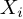
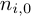
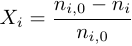

# Unified Data Model Glossary
### UDM Version 6.0

## 1. Introduction

This document gives definitions for the key entities used in the Unified Data
Model (UDM) Version 5.0 Brooklyn. This version, released in November 2018 is
publicly available to all interested parties, and it has been developed
significantly since the first release, version 4.0, in June 2018.

## 2. Summary of Version 5.0 Brooklyn

The latest update of the UDM file format v5.0 Brooklyn includes enhanced
representation for reaction conditions and new vendor extension options
allowing them to customise parts of the system; this overcomes the existing
barrier to data exchange that vendor- specific ELNs cause, by instead making
data interoperable and shareable. The implementation of the UDM format
provides a number of other benefits for life sciences organisations and
vendors, such as more accessible data and a reduction in duplicate data. As
well as accelerating research and reducing the time and cost taken to convert
data, the new format will help ensure the consistency and quality of
experimental data.

## 3. Version control

The version of this glossary is only relevant to the current version of UDM,
version 5.0 Brooklyn. For any future version of UDM, a new version of the
glossary will be produced and is part of the delivery package for a new
release. We advise users to keep to these definitions, but if you have
suggestions, please contact udminfo@pistoiaalliance.org.

## 4. Audience

The glossary has been prepared to support the users of UDM v 5.0 Brooklyn to
clarify the meaning of some key terms included. The definitions have been
taken from various sources and validated by the UDM Project team, made up of
representatives from vendor and pharma companies. Where appropriate examples
have been included. This glossary is covered by the same licence as the UDM
file format.

## 5. Glossary Terms

### Catalyst

Catalyst of a reaction, i.e. a substance added to the reaction in small
amounts that are not consumed during the reaction but are necessary to realise
it. Within the UDM definition, the catalyst is a property of a variation of a
reaction.

### Conversion (Product)

The conversion indicates, which portion of the originally used starting
material has been converted into other chemical substances by a chemical
reaction, i.e. the conversion (rate) 
is the proportion of the converted amount of the component _i_ relative to its
originally used amount  where
 is the residual amount of the
component _i_ still remaining:

### DOI

Digital Object Identifier (DOI) is a persistent interoperable identifier for
an object on digital networks according to ISO 26324. It is mainly used to
identify academic, professional, and government information, such as journal
articles, research reports, data sets, official publications, and media by
well over 5,000 assigners, e.g., publishers, science data centres, movie
studios, etc. Approximately 175 million DOI names are assigned to date
(November 2018) according to [doi.org](http://www.doi.org/).

### Enantiomeric Purity

Enantiomeric purity for a chiral substance is measured as enantiomeric excess
(ee) that reflects the degree to which a mixture of a chiral substance
contains one enantiomer in greater amounts than the other.

### Equivalent

The equivalent (or ratio) is the quotient of quantities of the same kind for
different components within the same system. It can be represented as the
equivalent amount of a substance needed to

- React with or supply one mole of hydrogen ions (H+) in an acid-base reaction
- React with or supply one mole of electrons in a redox reaction

Use this field for reaction ratios for reactants or mixtures of solvents as
well.

### Example (Reaction Variation/Chemical Group)

In the context of protecting groups, the example field contains information
about specific examples for protecting group reactions. It distinguishes two
types of example reactions: stability examples and lability examples.

### Loading (Reactant Property)

In the context of solid-state reaction loading it represents how reactants are loaded to the
resin as the solid phase of a reaction.

Loading from the [IUPAC Gold Book](https://goldbook.iupac.org/)

- Carbon loading of the packing material in liquid chromatography,
- Liquid phase loading in chromatography
- Load (on a precision balance)
- Loading capacity in solvent extraction

### Patent Assignee

Patent is a set of exclusive rights granted by a sovereign state to an
inventor or assignee for a limited period of time in exchange for detailed
public disclosure of an invention.

Accordingly, the field contains information about the patent inventors or
assignees.

### Patent Kind Code

Code of the kind of a patent describing its status, e.g. "B1" stands for
"Examined granted specification" in the context of the European Patent office
(EP).

### Preparation

Preparation comprises the reaction recipe and preparation comments.

Sources: CCR, ELAN and Roche in-house reaction databases - conditions other.

### Product

The product is a chemical compound resulting from a chemical reaction. Within
this context, it is assumed that the product is isolated at the end of the
reaction.

### Protecting (Chemical Group)

A protecting group or protective group is introduced into a molecule by
chemical modification of a functional group to obtain chemoselectivity in a
subsequent chemical reaction.

The field defines the protecting group involved in a specific reaction to
protect a functional group against other agents.

### Reactant

Starting material (educt) of a reaction. A reactant contributes atoms to the
creation of products and is changed and consumed by the reaction, therefore.

### Molarity (Reactant)

The field molarity contains the amount of a reaction component divided by the
volume of the mixture.

The molarity is also called amount-of-substance concentration or substance
concentration (in clinical chemistry). For entities B it is often denoted by
[B]. The common unit is mole per cubic decimetre (mol/dm^3) or mole per litre
(mol/L) sometimes denoted by M.

### Reaction Scale

Rough range in mass or volume of a chemical reaction like gram level, kilo
level, etc. It can be also used to represent the type of chemistry lab the
reaction was performed at: medicinal chemistry, kilo lab etc.

### Reagent

A reagent is a substance or a compound added to a system to cause a chemical
reaction, or added to test if a reaction occurs. It does not contribute to the
product directly.

Like catalysts and solvents, the reagents of a reaction are a member of the
variation properties. Known under "agent" as well.

### RXNStructure

Representation of a chemical reaction containing the chemical structures of
starting materials (educts, reactants) and products, e.g. as RXN file (format
described in the RXN file sections in [CTFile Formats](https://www.3dsbiovia.com/products/collaborative-science/biovia-draw/ctfile-no-fee.html), © 2018 Dassault Systèmes).

### Solvent

The term "Solvents" refers to a class of chemical compounds described by
function - the term derives from Latin, meaning roughly to "loosen." In
chemistry, solvents - which are generally in liquid form - are used to
dissolve, suspend or extract other materials, usually without chemically
changing either the solvents or the other materials.

In the context of a reaction, solvents are substances used to solve the
components of the reaction process.

Like catalysts and reagents, solvents are a member of the variation
properties.

### Tolerated (Chemical Group)

In the context of protecting groups, the tolerated groups are those functional
groups that are tolerated under the defined reaction conditions, i.e. that do
not participate in the reaction.

### Variation (reaction)

A reaction may be performed in one or more variations. Each variation is
defined by its set of reaction conditions (recipe, temperature, pressure,
yields, etc.) including the amount and concentration of the related reactants,
catalysts, solvents and other regents.

A variation may consist of multiple stages. While it is assumed that the
products of a variation are isolated and cleaned-up the product of a stage are
immediately transferred into the next product without any purification.
